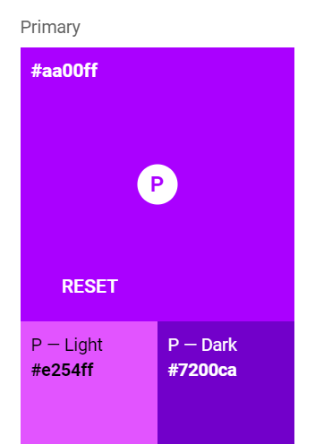
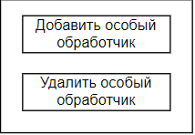

<div style="display: flex; gap: 24px; justify-content: space-between; align-items: center;">
  <div>
    <h1 style="margin: 0">ПРИЛОЖЕНИЕ ДЛЯ НАСТРОЙКА ЧАТ-БОТА</h1>
    <p style="font-size: 1.15em;">
    <code>Инструменты для установки конфигураций телеграм бота</code>
    </p>
  </div>
  
</div>

<h2 style="text-align: center; margin-top: 4em;">Содержание</h2>
<ol>
  <li>
    <a style="font-size: 1.15em;" href="#">Пример конечного файла конфигураций</a>
  </li>
  <li>
    <a style="font-size: 1.15em;" href="#">Изменение конфигураций на сервере</a>
  </li>
  <li>
    <a style="font-size: 1.15em;" href="#">Жизненый цикл приложения</a>
  </li>
  <li>
    <a style="font-size: 1.15em;" href="#">Стили: цветовая схема</a>
  </li>
  <li>
    <a style="font-size: 1.15em;" href="#">Макеты элементов управления и компонентов</a>
  </li>
  <li>
    <a style="font-size: 1.15em;" href="#">Ссылки</a>
  </li>
</ol>
<a href="#"></a>

<div style="margin: 0 0 2em 0;">
  <h2 style="text-align: left; margin: 4em 0 0 0;">
    1. Пример конечного файла конфигураций
  </h2>
  <code>Поле установки всех необохдимых настроек в поле <tt>output</tt> будут находится кофигурации бота в формате <tt>json</tt></code>
</div>
<h3>Пример:</h3>

```json
{
  "routes": {
    "route": {
      {route}
    }
  },
  "customRouters": {
    "feedbackRoute": {
      {route},
      {route},
      {route}
    }
  }
}
```

Объект маршрута, в коде обозначен как `{route}`

```json
"route": {
      "message": {
        "text": "Текстовое сообщение ответа",
        "keyboard": [
          ["1-ая кнопка 1-ой строки", "2-ая кнопка"],
          ["1-ая кнопка 2-ой строки"]
        ],
        "parseMode": "HTML" | "md"
      },
      "isSendImage": true | undefined,
      "isSendAudio": true | undefined,
      "isSendVideo": true, | undefined,
      "pathToFile": "Путь к файлу прикрепленого контента",
    }
```

<div style="margin: 0 0 2em 0;">
  <h2 style="text-align: left; margin: 4em 0 0 0;">
    2. Изменение конфигураций на сервере
  </h2>
  <code >Изменить конфигурации на сервере можно прямо в приложении в окне <tt>deploy</tt></code>
</div>

Для этого достаточно указать публичный ключ сервера и подтвердить действие.
Также конфигурации можно изменить вручную, использую любой доступ к серверу, загрузив файл в папку <tt>configs</tt> на сервере.

<div style="margin: 0 0 2em 0;">
  <h2 style="text-align: left; margin: 4em 0 0 0;">
    3. Жизненый цикл приложения
  </h2>
  <code>Диограмма жизненого цикла приложения</code>
</div>


<div style="margin: 0 0 2em 0;">
  <h2 style="text-align: left; margin: 4em 0 0 0;">
    4. Стили: цветовая схема
  </h2>
  <code>Основные цвета для отрисовки элементов интерфейса</code>
</div>

<div style="display: flex; flex-wrap: wrap; flex-direction: row; justify-content: space-evenly; gap: 1em;">

<div style="display:flex; justify-content: space-between; margin: 1em 0; align-items: flex-start;  gap: 2em;">
<div>
<h3>Первичный цвет и оттенки:</h3>

Базовый — <tt style="background: #aa00ff; color: #fff; font-weight: 600; padding: 0 4px;">#aa00ff</tt>

Светлый — <tt style="background: #e254ff; color: #000; font-weight: 600; padding: 0 4px;">#e254ff</tt>

Темный — <tt style="background: #7200ca; color: #fff; font-weight: 600; padding: 0 4px;">#7200ca</tt>

</div>

</div>

<div style="display:flex; justify-content: space-between; margin: 1em 0; align-items: flex-start; gap: 2em;">
<div>
<h3>Вторичный цвет и оттенки:</h3>

Базовый — <tt style="background: #ffb314; color: #000; font-weight: 600; padding: 0 4px;">#ffb314</tt>

Светлый — <tt style="background: #ffe553; color: #000; font-weight: 600; padding: 0 4px;">#ffe553</tt>

Темный — <tt style="background: #c78400; color: #000; font-weight: 600; padding: 0 4px;">#c78400</tt>

</div>

</div>
</div>

<div style="margin: 0 0 2em 0;">
  <h2 style="text-align: left; margin: 4em 0 0 0;">
    5. Макеты элементов управления и компонентов
  </h2>
  <code>Макеты, а также описание, содержание и принцип работы.</code>
</div>

<div style="display: flex; flex-direction: row; justify-content: space-between; gap: 2em;">
<div>
<h3>Боковая панель</h3>
В верхней части содержит логотип преложения, название и кнопку настройки, а также название чат-бота

<br>
Ниже расположены кнопки управления. Кнопки управления напрямую вызывают комиты в <code>$store</code>

<br>
<div style="display: flex; gap: 2em; justify-content: space-between;">
В макет не вошли элементы управления особыми обработчиками, так-как боковая панель имееет ограниченную область видимости и часть контента скрыта, для перемещения используется слайдер

</div>
</div>

</div>

<div style="margin-top: 2em;;display: flex; flex-direction: row; justify-content: space-between; align-items: flex-start; gap: 2em;">
<div>
<h3>Компонент настройки маршрута</h3>
В верхней части содержит название маршрута.
Главная часть стостоит из кнопок управления:

<ol style="display: flex; flex-direction: column; gap: 1em;">
<li>Текстовое сообщение — Указать текст ответа, после нажатия на кнопку на её месте появляется текстовое поле.</li>
<li>
  <div style="display: flex; gap: 1em; align-items: flex-start;">
    <span>
    Использовать клавиатуру — Указать кнопки клавиатуры,после нажатия на кнопку на её месте появляется заголовок и кнопки для формирование клавиатуры
    </span>
    
  </div>
</li>
<li>
<div style="display: flex; gap: 1em; align-items: flex-start;">
  <span>
  Использовать персер — Указать парсер для текстового сообщения. На месте кнопки появляется заголовок и радио кнопки выбора парсера
  </span>
  
</div>
</li>
<li>
<div style="display: flex; gap: 1em; align-items: flex-start;">
  <span>
  Прикрепить файл — Прикрепить Фото / Аудио / Видео к сообщению. На месте кнопки появляется группа кнопок выбора файла.
  </span>
  
</div>
</li>
<li>
<div style="display: flex; gap: 1em; align-items: flex-start;">
  <span>
  Использовать обработчик — Указать особый обработчик, если он существует, маршрут будет на него ссылаться, если нет создаст новый.
  </span>
  
</div>
</li>
</ol>
</div>

</div>

<h3>Особый обработчик</h3>
<div style="margin-top: 2em;;display: flex; flex-direction: row; justify-content: space-between; align-items: flex-start; gap: 2em;">
<div>
В верхней части содержит название обработчика.
Главная часть стостоит из кнопок управления:
</div>

</div>

<div style="margin: 0 0 2em 0;">
  <h2 style="text-align: left; margin: 4em 0 0 0;">
    6. Ссылки
  </h2>
  <code>Дополнительные ресурсы, не вошедшие в документацию</code>
</div>

<h3>Дизайн проект в Figma</h3>
<div style="display: flex; flex-direction: row; gap: 2em; justify-content: space-between;">
<span>
Дизайн компонентов и элементов интерфейса. Ссылка:
<a href="https://www.figma.com/file/qpB1c1YR2W2hqpkOGWLA21/configSetupApp?node-id=103%3A3">Проект в Figma</a>
</span>

</div>

<h3>Диограммы</h3>
<div style="display: flex; flex-direction: row; gap: 2em; justify-content: space-between;">
<span>
Макет компонентов и элементов интерфейса. Жизненный цикл приложения, ссылка:
<a href="https://viewer.diagrams.net/index.html?tags=%7B%7D&highlight=0000ff&edit=_blank&layers=1&nav=1&page-id=FIUpleBscJHet85toNLr&title=diogramConfigSetupApp.drawio#R%3Cmxfile%3E%3Cdiagram%20id%3D%229YiMlIp7Vkp76OhkYZI1%22%20name%3D%22%D0%96%D0%B8%D0%B7%D0%BD%D0%B5%D0%BD%D0%BD%D1%8B%D0%B9%20%D1%86%D0%B8%D0%BA%D0%BB%22%3E7Vnbkto4EP0aHjflCwbzyG2SrSWV1FKVZPdN2AJrIyxWFgPO16dlSbaMMTAzMJlJUkUZ66glt7v7tFpyxx%2Bv92852iTvWYxpx3PifcefdDzPdQIX%2FiSSKyTo9hWw4iRWkFMBc%2FINm5Ea3ZIYZxpTkGCMCrKpgxFLUxyJGoY4Z7u62JLRuAZs0Ao3gHmEaBP9TGKRKDT0%2BhX%2BDpNVYp7s9gaqZ4GiryvOtql%2BXspSrHrWyEyj3zFLUMx2FuRPO%2F6YMybU3Xo%2FxlSatW6xu5beUmWOU3HJgPuR6zjb7P8P%2FeGnz7N%2F53H2159%2F6NfIRG5MgWOwjG4yLhK2Yimi0wodFa%2BL5awOtCqZGWMbAF0A%2F8NC5NrNaCsYQIlYU92rnikf1PoqGsrYlkf4hP6eDhbEV1ickAtLg0MMY7bGgucwjmOKBLmv64F0MK1KucqqcKMN%2BwAjayXvEd3qJ3XAdIOuvI6m0NMBs4Subsprv7gqAae4ToprWEjeNZyW7ciaohSXxr3HXOD9afM2zaEHdHXE5vXmrmKG52gssVhRglc3oH%2FcgH3LPn5hGWVJ37LhUMt4TotJJ8WQUXENjFioZ9DNkeWaoTWDGjW2ZpsaZWzPBka3pjfLyZVnB0bbA%2F%2FWKbdLiMDzDSqYsYOMfIxeZyKgPVBbw8I7GxZu70hY9G4VFd1njYqCoTWq2m71GsjrcKLr%2FWgvuv1XvgSFFy5BbkvSvXgNKoYOOUe5JbBhJBWZNfNHCVT%2B9rte3eHdgyrhnLzrHLhYaVA5vHyVx8dA2GSy180E47i50iVoI2%2BjnBIIAe6fp9JCBctsUQJl0fZhK2AarPFMRYsbwP2SUDpmlPHisX4c4DDuShnB2Vds9YTewu%2F1rrPwliwzxnea7DxGzvBW5DSvcJhj7xrpLtCJVGdUOwkf5Ea4htYQeylUyPjG5U3QH7yw%2BsbsMy4iQGWLJUuFyZMyD0YJofEM5WwrNc4EhLlpjRLGyTeQR4YE0M2Fzo%2B%2BU5OYy5F6To4lKz4a47oH0Hu0rwnOUCaMNoxStMnIghp%2BrSFFknTEhGBrLXQjmp0I5muXN7I8uE1QHMmKYLNhuU84XVkC7uny9HyVU3DPM3T1emBwV7rnUdVvWS89tO61yu8DFSZWvXZB%2FXXIGQgV0QiqYqtej0ANIUpWKTQpXsphMtZIhOhQw2sSx0UVksGSQ9LVrBCbdCvkbx0eEmIwfEmLjX8CAzHMMNKLNugWjOAHCo%2BdN0EnAF3H0HarNvykOBdjloL6iBQRjoFlOyyZBpWQQAItyhzwBHr0j9ND88G%2FkA%2FBzfhwZBt96Gi5qm9aTaBPj7S1OiXjL186%2FOClbY3d5gq9YIjHv9i6gXC4jI6tG70oxIvl04jxurbFbstx09RaExwr99rnTl5jdwwCEytdmwqtVr%2Bpaa1JfuffR4RZ2%2F7wgfnXv1lcNesReUafzUmMF4j%2F5AnnudLHCziQGVw5f6iDt7tGMeg18srpQ%2B7fWeSSLNLypeOlZBET3q27mtNfP9Qu4YnHAw%2Bi6Q88FfAbb%2FoMJ6NgJZ5%2F0eOLxj%2By8SYwzcne7pzktZC9zkc9bdGzR6pt1fpTP%2BtBs%2Fouqw45q%2B%2Fe%2FvQ7%3C%2Fdiagram%3E%3Cdiagram%20id%3D%22FIUpleBscJHet85toNLr%22%20name%3D%22%D0%A1%D1%82%D1%80%D0%B0%D0%BD%D0%B8%D1%86%D0%B0%202%22%3E7V1Nk6o4FP0ts7BqZmFXPgBhqd36ejFvMfWmat6WVlqpRnCQ%2FnB%2B%2FQRIMEiiokCivA1iEoKcc3O59xDiAD%2Buv77F7mb1PVp4wQCBxdcAPw0QsrBFtmnBLi9ADswLlrG%2FyIvAvuCH%2F5%2BXF0JW%2Bu4vvC0ty4uSKAoSf1MunEdh6M2TUpkbx9FnudlrFCxKBRt36VUKfszdoFr6j79IVnmpjUb78mfPX67YmaHl5DVrlzWmV7JduYvokyvC0wF%2BjKMoyffWX49ekGJXxmUmqS1%2BWOyFyTkHPH97Gv98nP5lzXdJ%2BNN8Dl820yGk1%2FHhBu%2F0iumvTXYMgjh6Dxde2gsY4Mnnyk%2B8Hxt3ntZ%2BEs5J2SpZB%2BQbJLu0Oy9OvC%2FpD4XF5ROz8aK1l8Q70oSaiGHRQz73gEOT2tGKBxvYlGhK8rLoa48D2aFQ1IAFa4TKKRQMbLaEgllFgVzsGKbbyTTbjrKtkW3BgFyrjbItOSHICh%2B5qnxrc%2FuYHqIMXHYANaQdMyxUtUA2jnnsMWgJeksMPS7DTbaTbGvfD%2FSGrRh6gUfcW%2F2YQ3ByOej54bpB71iKobevgn6afeW9E2SNyb7JNSuqADeSINdJ3vOIja387Nm%2BZpwhQ7WncsScPXGc5cjOOHyBns4HY0MxmizsPYDTMagN74GccMbsaAfkyFENJLrKlzxxPqOw4LzNjAt8%2BMZPFWeTHYjAw8ODbvwge6SaH3FwSQ19ynlkwLCXxTnH%2Fb5zrd%2FXjDpjpNxHNRGc9os0EwlS2m5JE9ynD0FaEpQ20ounCov7wpqDs0E5lcKO2srjjdMX3bxlHMFfI2igQONIHTB%2FY8PcGOTjDcTtj9lQtdkO7wFkt8bqEM4OOSSHwJyUGdgmcfTmPUZBFJOSMApJy8mrHwQHRW7gL0PydU5o8Uj5JCXNn7vBmFas%2FcUiPY2Q8rJRNM867YYpNywBGz2YFTdhCyWflowCCTKwzrwE7QhZgthENDSQ47Q1Ns6AoSO%2FkTNS32%2B0Bw4SpCjN20ijYLTmRNkV6WAoQDdsxBmYc6YsKUybbv1%2BICNJ2%2FuBOEgYI06OKDSe4j5eDRIOEulpJbZ3uA6fuEje1M3viuN7B1RvWZ2G90gQ6aaDzRYJcHk0l2VjeymDJ034JGfMhYEHOfnBIbg0nm%2BCQIiRagYlgkiDDM4qnheyYZeV3AZTyvUPJNY%2FnBmnUhQPDYoSXrutKiJkh0%2BbHErxTTCCoOrnRkj8zO6sscM%2Fxz4ydm5er2qCaFO1aoxUqli0I8MQPNsQRdaYTXVqfnrKGSlYVxZ0oa6FR23ZCD4jJ2srP9VN5GNRjQaGgnXThrFEAO1zfiojSdf8FIvTnj7kp8eVZd3yUyzObia1HvfeAtLQVJ1IYkl60oNEshZTJJBTzZQkbbmjRLIeI7bqRBKLZyD%2BSiSbJRoj1YkkFk9bdC4QOe%2FywfUJPg3z4SAURNVI0DI7JNQQpcSzbeLGyW2MCejgCoJsLnw3CAry5vsI0UbmSaQt3CHSpiAYbl6hOJ7KWUxK412wbQhQMNpSsUxBoKrIgHJGLlCx2I2seXDOeDGvJRXrUjBaU2pMfabj5LTohI0kkOmziiUjSVcVyxK%2F9NEDFUvmajRVsSxxiNTjWRb1CFQ%2Fy8KSiP73I7nUY0T9%2B4PWFTOXei251CTariY9HRPdydzyi6ACBwGBACosCAjMtoI6C4nHBHsrkQZvauzOOj5n5NDsKlCye0A3RldNtZ%2F%2F%2Fv7nddgJo%2BHWAGXTTeSIGp0O42rWvl7cEp7OSTxRl7KbdcXctZYe1916%2FiczgFP%2BvL11Lc5YT6htwc%2BGguxJuJ4QaOvNIVuf1zFzRurrOC2C04ko3CgYrYlatj7KsK2bGGpL7hd9FvxkJOkq%2BNmShY7uX%2FCTuRpNBT9boq73V%2FCrR6B6wc8Ra%2Bs9mA1Xkynlr1U5EtHjlxDYKNFYtLxCt0RLXio2yvBm%2BzcBaSHAqINUlFmRiAbDPLCygjS%2B227csASn9e97uvrwZJ4HdelSLvHy5XfyK9Mhwz7%2ByLoAr1GYDF%2FdtR%2Fs8qbPXvDhpcEeV7%2FNFnBOayHafPEV%2BUnTmjCK127A1X24se%2BSTxIyusl7nC73fLTd3N3ImnxStNNKA%2BQXDwIvIcHpkFz%2B3A%2BX1SOjeLNyQ9olysvSkHhIo9u0uAhwWZ1P7DCkZwLsUrOaJCadvZL%2B2ZmonpWaR7YeNXeazyhelH9Y0Re5lpc3n3SX9pnH40NqYKV2L%2B78bZmNi%2BEBj9n8sZTCTEPMdkzGZtbrwptHsZv4UThMVv78LfS29Of5oZ%2F4DJ%2FDthyXR9txP6fU7jWI3OQQnIW%2F3QTujjUPfFKBwG%2F%2BehPFiZsiPdkbLNlbZp9tPbvLB0w6gzAbM%2FRspSG13723bOqE8xuVnR9bWYx3frBLBdWRvDlfZL6ATWK0b%2BquYiu%2Fq0jeJOETFH5h0hsBFosstltgO5ncd1wPdkTJdbcrSTn6zOtzLpzX1yI4nbzq3igY7a1VCPR54d3R7R1vCCSz0vqsCMtY0lURLv5xon%2BSsMzbaCoJQyCZQthfTbgeg%2Bo1YQjaXy1NU1G4JlXKRWEIJMnd%2FUzYrUeJ%2BsW2ILhigYFeC%2FU1mVa%2B2hYU%2FRtJ13kqFE7H7Xg9aKjPOr%2BUlPoJCLTbsxNB8NpRrnoxHO3lY6KV9ZUZC9IOHUns1bHLv%2FUEV8qsthlug%2F%2F4o8s%2FG9bzSLomtIK%2Fhpn5oRsEu3vEG%2BL2wirydf9%2Fvlkd96fIePo%2F%3C%2Fdiagram%3E%3C%2Fmxfile%3E">открыть диограммы</a>
</span>

</div>

<h3>Цветовая палитра</h3>
<div style="display: flex; flex-direction: row; gap: 2em; justify-content: space-between;">
<span>
Google material color tool, ссылка на иснтрумент:
<a href="https://m2.material.io/resources/color/#!/?view.left=0&view.right=0&primary.color=AA00FF&secondary.color=ffb314">открыть палитру</a>
</span>
</div>
